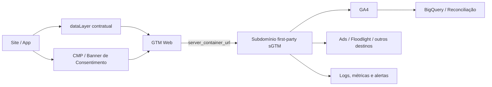
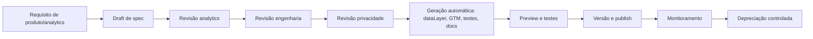

# Framework Spec-Driven para Tracking com GA4 e GTM Server-Side

## Resumo executivo

A melhor forma de implementar tracking com GA4 e GTM Server-Side de maneira escalável não é começar por tags; é começar por um **contrato versionado de medição**. Em termos práticos, isso significa manter um repositório onde cada evento é definido como especificação formal — com dono, regra de disparo, consentimento exigido, mapeamento para GA4, regras de qualidade, testes esperados e critérios de observabilidade — e só depois gerar, a partir desse contrato, o `dataLayer`, a configuração de GTM web, a configuração de GTM server-side, os testes e a documentação operacional. Esse desenho é o que melhor aproveita as capacidades oficiais do stack da entity["organization","Google","technology company"]: eventos recomendados e schema padrão de ecommerce no GA4, envio para server container via `server_container_url`, clientes e transformações no server container, Consent Mode v2, validação via Measurement Protocol debug endpoint, Preview/Debug do sGTM e automação via Tag Manager API. citeturn31view0turn31view2turn37view0turn16view0turn11view11

A recomendação central deste relatório é a seguinte: use os **eventos padrão de ecommerce do GA4 como semântica canônica** sempre que houver correspondência direta (`view_item`, `add_to_cart`, `purchase`), envie os hits do navegador para um **subdomínio first-party** do server container, deixe o navegador responsável por coletar contexto e consentimento, e deixe o servidor responsável por **sanitizar, enriquecer, rotear e controlar** os dados antes de enviá-los aos destinos. O Measurement Protocol deve entrar como **complemento** para eventos offline, backoffice ou server-to-server, e não como substituto integral da coleta automática do navegador; a própria documentação oficial diz que ele “augmenta” a coleta existente, não a substitui. citeturn15view1turn15view2turn15view3turn11view4turn16view1

Também há uma conclusão forte para o uso de IA generativa: **IA sem spec vira adivinhação; IA com spec versionado vira automação auditável**. Como GTM expõe API para workspaces, versões e publicação, e como templates customizados são sandboxed e permissionados, um repositório de specs bem estruturado cria a base certa para geração de container payloads, testes, linters, documentação e até scaffolds de templates. Mas há um limite claro: IA é ótima para boilerplate, diffs de mapeamento, validação e geração de testes; ela é ruim como autoridade final para semântica de negócio, decisão jurídica e modelagem de identidade. Isso é uma inferência arquitetural sustentada pelas capacidades oficiais da Tag Manager API, dos templates customizados e do pipeline de validação do Measurement Protocol. citeturn34view0turn34view2turn34view3turn11view12turn32view0

## Arquitetura de referência

O desenho de referência para o seu caso é: **site/app → `dataLayer` contratual → GTM Web → Server Container → GA4 e demais destinos**. O lado web continua necessário porque é ele que captura o contexto da sessão, o consentimento, o `client_id`/cookies first-party e os eventos de interface. O server container entra para receber a requisição HTTP, deixar um client “claimar” a entrada, transformar a requisição em evento interno, aplicar transformações de privacidade, e então disparar tags server-side para GA4 e outros destinos. A documentação oficial do sGTM recomenda o uso do GA4 tag no web para enviar dados ao server container e explica que clients são adaptadores entre o software no dispositivo e o container do servidor. citeturn37view0turn31view2turn31view1



Esse arranjo fica melhor quando o server container roda em **first-party context** com domínio customizado ou same-origin. A documentação oficial trata same-origin serving como boa prática porque isso permite aproveitar os benefícios de segurança e durabilidade de **cookies definidos pelo servidor**, inclusive `HttpOnly`, e porque first-party context melhora a qualidade da coleta num cenário em que navegadores impõem cada vez mais restrições a third-party cookies. Em produção, a rota recomendada de infraestrutura é Cloud Run com domínio customizado; para tráfego real, o material de aprendizado do Google recomenda começar com **mínimo de 3 instâncias** para suportar produção e escalar conforme o volume real de requests e a complexidade das tags. citeturn11view4turn31view0turn31view3

A tabela abaixo resume os três modelos operacionais mais relevantes para o seu caso.

| Modelo | Quando usar | Vantagem principal | Limite principal |
|---|---|---|---|
| **GTM Web apenas** | MVP simples, baixo rigor operacional | Menor complexidade inicial | Menos controle de privacidade, qualidade e roteamento do que sGTM. citeturn31view1turn31view0 |
| **GTM Web + GTM Server-Side** | Recomendado para ecommerce com governança | Melhor equilíbrio entre performance, privacidade, qualidade e controle de destinos | Exige infra, observabilidade e processo de release mais maduros. citeturn31view0turn31view2turn23view4 |
| **Measurement Protocol-only** | Eventos offline ou estritamente server-to-server | Bom para complementar conversões offline e eventos fora da UI | Não substitui a coleta automática; alguns recursos e regras de interface não se aplicam, e o MP foi desenhado para complementar. citeturn16view1turn37view0 |

Se o objetivo é um framework próprio, o caminho mais sólido é o segundo: **web + sGTM**, com MP apenas para extensão do modelo.

## Framework spec-driven

O framework deve tratar tracking como **produto interno**, com quatro artefatos acoplados por contrato: **spec**, **mapping**, **runtime config** e **tests**. A unidade mínima não é “uma tag”, mas um **evento especificado**. Cada spec deve responder, no mínimo, a 10 perguntas: qual é o significado do evento, quando ele dispara, quem é o dono, qual consentimento ele exige, quais parâmetros são obrigatórios, quais são opcionais, qual a origem de cada campo, qual a validação, como ele é observado em produção e como é descontinuado. Isso elimina o padrão frágil de tickets dispersos, nomes inconsistentes e regras escondidas em tags. A própria documentação do data layer reforça que variáveis e nomes precisam ser consistentes entre páginas, que `dataLayer.push()` é processado em ordem FIFO e que sobrescrever `window.dataLayer` quebra o funcionamento esperado. citeturn21view0

Para ecommerce no GA4, a convenção mais eficiente é esta:

- **Evento canônico = nome padrão do GA4**, quando houver equivalente oficial. Ex.: `view_item`, `add_to_cart`, `purchase`.  
- **Nomes em `snake_case`**, sempre minúsculos. O GA4 exige que nomes comecem com letra, usem apenas letras, números e underscore, e não usem prefixes ou nomes reservados. Nomes são case-sensitive. citeturn11view14
- **Campos técnicos fora do payload semântico**, por exemplo em `_meta`, `event_context` ou `tracking`, para não poluir o mapeamento de negócio.
- **IDs estáveis e semântica imutável**. Se o significado do evento muda, a versão do spec muda; não se “edita silenciosamente” um evento em produção.
- **Um owner por evento**, normalmente Produto/Analytics, com revisão obrigatória de Engenharia e Privacidade.

Um esqueleto de repositório que funciona bem para esse modelo é o seguinte:

```text
tracking/
  specs/
    events/
      view_item.v1.yaml
      add_to_cart.v1.yaml
      purchase.v1.yaml
    shared/
      item.schema.json
      money.schema.json
      consent-profiles.yaml
  mappings/
    ga4/
      ecommerce.map.yaml
    datalayer/
      ecommerce.contract.json
  gtm/
    web/
      generated/
      manual-overrides/
    server/
      generated/
      templates/
      transformations/
  tests/
    unit/
    contract/
    integration/
    synthetic/
  tools/
    generators/
    linters/
    validators/
  docs/
    changelog.md
    governance.md
    runbooks/
```

Minha recomendação é versionar specs em **SemVer independente** do versionamento do container GTM:

- **Major**: quebra de contrato ou semântica.
- **Minor**: adição compatível.
- **Patch**: correção documental, descrição, default não-breaking.

No plano operacional, use **Git para versionar specs** e **Tag Manager API para versionar a configuração**. A API oficial oferece `workspaces.create`, `workspaces.sync`, `workspaces.getStatus`, `workspaces.create_version`, `versions.publish` e até `bulk_update`, o que é suficiente para um pipeline de CI/CD com geração, preview, criação de versão e publicação controlada. O rollback operacional, na prática, pode ser implementado republicando uma versão anterior do container — isso é uma inferência direta do modelo oficial baseado em versões publicáveis. citeturn34view0turn34view1turn34view2turn34view3turn34view4

O processo de governança recomendado é este:



Isso é o que separa um framework “spec-driven” real de um conjunto de planilhas com nomes de eventos.

## Mapeamento técnico

O núcleo técnico aqui é simples, mas precisa ser rígido. O GA4 standard ecommerce já define a semântica dos principais eventos, então o papel do seu framework é **normalizar o contrato de entrada** e **evitar divergência entre browser, server e warehouse**. Os três eventos mínimos do seu MVP devem ser `view_item`, `add_to_cart` e `purchase`, todos com `items` corretamente preenchido. Para `view_item` e `add_to_cart`, `items` é obrigatório; `currency` passa a ser obrigatória quando `value` é enviada; `value` deve ser a soma de `price * quantity` dos itens, sem incluir `shipping` nem `tax`. Em `purchase`, `transaction_id` é obrigatório e serve para ajudar a evitar duplicidade; `shipping` e `tax` são parâmetros independentes, fora do cálculo de `value`. No nível do item, ao menos um entre `item_id` e `item_name` é obrigatório, e é possível enviar até **27 custom parameters** adicionais por item. citeturn15view1turn15view2turn15view3turn14view4turn14view5

Abaixo está uma tabela curta com o contrato funcional mínimo.

| Evento | Obrigatórios | Regras críticas |
|---|---|---|
| `view_item` | `items`; `currency` se `value` existir | `value = Σ(price * quantity)` dos itens. citeturn15view2 |
| `add_to_cart` | `items`; `currency` se `value` existir | Mesmo cálculo de valor; evita tax/shipping no valor. citeturn15view1 |
| `purchase` | `transaction_id`, `items`; `currency` se `value` existir | `transaction_id` deve ser único; `shipping` e `tax` vão fora do cálculo de `value`. citeturn15view3turn13view0 |

O `dataLayer` deve ser tratado como **contrato de entrada**, não como dump de estado da página. A documentação do Google recomenda definir `window.dataLayer = window.dataLayer || [];` antes do container, usar `dataLayer.push()` para eventos e variáveis, evitar sobrescrever `window.dataLayer`, manter nomes consistentes entre páginas e garantir que variáveis que precisem existir em cada page load sejam repushadas em cada página. Além disso, quando consentimento está em jogo, o Google recomenda **não usar Custom HTML para configurar consent** e aplicar as Consent APIs para que a atualização de consentimento seja processada antes de outras mensagens na fila. citeturn21view0

No sGTM, o **GA4 Client** costuma ser o cliente principal para o fluxo web. Ele pode reivindicar requests GA4 em paths padrão como `/collect`, `/g/collect` e `/j/collect`. Em server containers, um request só pode ser “claimado” por um client, então a prioridade dos clients importa. O guia oficial também recomenda usar a tag GA4 no web para enviar dados ao server container, porque ela pode usar diferentes transportes no browser para melhorar a taxa de entrega. citeturn11view2turn37view0

Para o Measurement Protocol, mantenha cinco regras rígidas: use `POST` em HTTPS, adicione `api_secret` na URL, envie `client_id` no body para web streams, inclua `session_id` e `engagement_time_msec` para Realtime e métricas de sessão, e use `/debug/mp/collect` com `validation_behavior: ENFORCE_RECOMMENDATIONS` durante desenvolvimento. A documentação oficial também deixa claro que o endpoint do MP retorna `2xx` mesmo quando o payload está incorreto, então **2xx não é prova de sucesso semântico**. Se você quiser coletar na UE, use `region1.google-analytics.com`. citeturn16view0turn18view2turn18view5turn32view0

Atenção a uma limitação importante: quando você usa o Measurement Protocol **para enviar dados ao server container**, isso **não é a mesma coisa** que enviar para o endpoint oficial do Measurement Protocol do GA4, e esse modo **não suporta todos os recursos** do endpoint oficial, como derivação completa de geografia e device a partir de tagging events. Isso é útil para ingestão customizada, mas não deve ser confundido com “MP oficial por trás do sGTM”. citeturn37view0

No tema identidade, o desenho correto é separar:

- **`user_id`**: identificador first-party seu, somente para usuário autenticado.
- **`client_id` / device ID**: identificador pseudônimo derivado do `_ga` no web.
- **`user_pseudo_id`**: campo exportado no BigQuery como identificador pseudônimo do usuário/evento.

A documentação oficial é explícita em quatro pontos: `user_id` deve ser seu, único, persistente, sem PII, com até 256 caracteres; em logout ele deve ser limpo com `null` e não com dummy values; ele **não deve** ser registrado como custom dimension; e, no BigQuery export, `user_id` e `user_pseudo_id` convivem no schema. O `client_id` do site vem do cookie `_ga`, mas não é armazenado quando `analytics_storage` está desabilitado pelo Consent Mode. Além disso, quando há cookieless pings sob consent mode, o BigQuery pode ter um `user_pseudo_id` distinto por sessão, o que muda a reconciliação entre UI e warehouse. citeturn11view7turn19view0turn19view2turn11view8turn24view0turn24view1turn24view2

Os exemplos abaixo são **modelos meus**, mas seguem a semântica oficial do schema padrão de ecommerce do GA4 e o desenho operacional recomendado para dataLayer + sGTM. citeturn15view1turn15view2turn15view3turn21view0

```yaml
# specs/events/view_item.v1.yaml
id: ecommerce.view_item
versao: 1.0.0
owner: analytics
descricao: Produto exibido em PDP ou módulo de recomendação.
consent_profile: analytics
ga4:
  event_name: view_item
trigger:
  source: web
  datalayer_event: view_item
payload:
  required:
    - currency
    - value
    - items
  properties:
    currency:
      type: string
      format: iso4217
      example: BRL
    value:
      type: number
      regra: "soma(price * quantity) dos items"
    items:
      type: array
      minItems: 1
      itemSchemaRef: ../shared/item.schema.json
quality:
  dedupe_key: null
  pii_allowed: false
  assertions:
    - "item_id ou item_name obrigatório por item"
    - "value >= 0"
```

```yaml
# specs/events/add_to_cart.v1.yaml
id: ecommerce.add_to_cart
versao: 1.0.0
owner: analytics
descricao: Item incluído no carrinho.
consent_profile: analytics
ga4:
  event_name: add_to_cart
trigger:
  source: web
  datalayer_event: add_to_cart
payload:
  required:
    - currency
    - value
    - items
  properties:
    currency:
      type: string
      format: iso4217
      example: BRL
    value:
      type: number
      regra: "soma(price * quantity) dos items"
    items:
      type: array
      minItems: 1
      itemSchemaRef: ../shared/item.schema.json
quality:
  pii_allowed: false
  assertions:
    - "quantity >= 1"
    - "price >= 0"
```

```yaml
# specs/events/purchase.v1.yaml
id: ecommerce.purchase
versao: 1.0.0
owner: analytics
descricao: Pedido concluído e autorizado.
consent_profile: analytics
ga4:
  event_name: purchase
trigger:
  source: backend_or_web
  datalayer_event: purchase
payload:
  required:
    - transaction_id
    - currency
    - value
    - items
  properties:
    transaction_id:
      type: string
      example: PED-2026-000123
      regra: "único por pedido"
    currency:
      type: string
      format: iso4217
      example: BRL
    value:
      type: number
      regra: "soma(price * quantity) dos items; não incluir shipping nem tax"
    tax:
      type: number
      default: 0
    shipping:
      type: number
      default: 0
    coupon:
      type: string
      nullable: true
    customer_type:
      type: string
      enum: [new, returning]
      nullable: true
    items:
      type: array
      minItems: 1
      itemSchemaRef: ../shared/item.schema.json
quality:
  dedupe_key: transaction_id
  pii_allowed: false
  assertions:
    - "transaction_id obrigatório"
    - "não enviar purchase duplicado para a mesma transação"
```

```json
{
  "$id": "schemas/datalayer/ga4-ecommerce.events.schema.json",
  "type": "object",
  "required": ["event", "ecommerce"],
  "properties": {
    "event": {
      "type": "string",
      "enum": ["view_item", "add_to_cart", "purchase"]
    },
    "ecommerce": {
      "type": "object",
      "properties": {
        "currency": { "type": "string", "pattern": "^[A-Z]{3}$" },
        "value": { "type": "number", "minimum": 0 },
        "transaction_id": { "type": "string" },
        "items": {
          "type": "array",
          "minItems": 1,
          "items": {
            "type": "object",
            "properties": {
              "item_id": { "type": "string" },
              "item_name": { "type": "string" },
              "item_brand": { "type": "string" },
              "item_category": { "type": "string" },
              "item_variant": { "type": "string" },
              "price": { "type": "number", "minimum": 0 },
              "quantity": { "type": "integer", "minimum": 1 }
            },
            "anyOf": [
              { "required": ["item_id"] },
              { "required": ["item_name"] }
            ],
            "required": ["price", "quantity"]
          }
        }
      },
      "required": ["items"]
    },
    "_meta": {
      "type": "object",
      "properties": {
        "spec_id": { "type": "string" },
        "spec_version": { "type": "string" },
        "consent_snapshot": { "type": "object" }
      }
    }
  }
}
```

```javascript
// gtm/server/templates/ga4-router/template.js
// Esqueleto ilustrativo de tag server-side customizada.
// Objetivo: enviar somente campos allowlistados para um endpoint interno/terceiro.

const getAllEventData = require('getAllEventData');
const sendHttpRequest = require('sendHttpRequest');
const queryPermission = require('queryPermission');
const logToConsole = require('logToConsole');

const event = getAllEventData();
const allowlist = [
  'event_name',
  'transaction_id',
  'currency',
  'value',
  'items',
  'user_id',
  'client_id'
];

function pick(obj, keys) {
  const out = {};
  keys.forEach((k) => {
    if (obj[k] !== undefined && obj[k] !== null) out[k] = obj[k];
  });
  return out;
}

const payload = pick(event, allowlist);

if (!queryPermission('send_http', data.endpoint)) {
  logToConsole('Endpoint não permitido pela policy/permissão:', data.endpoint);
  data.gtmOnFailure();
  return;
}

sendHttpRequest(
  data.endpoint,
  { method: 'POST', headers: { 'Content-Type': 'application/json' } },
  JSON.stringify(payload),
  () => data.gtmOnSuccess(),
  () => data.gtmOnFailure()
);
```

## IA generativa e aceleração

A maior aceleração não vem de pedir para a IA “criar tags”; vem de pedir para a IA **operar sobre um spec formal**. O melhor desenho é este: Produto/Analytics descreve o requisito; um gerador produz um draft de spec; outro gerador deriva schemas, mappings, nomes de variáveis, testes e documentação; um pipeline valida tudo; e só então o material é promovido a GTM via API. Isso funciona porque as superfícies oficiais já existem: Tag Manager API para workspaces/versões/publicação, custom templates com sandboxed JavaScript, políticas e permissões, transformações no server container e validação do Measurement Protocol. citeturn34view0turn34view2turn34view3turn11view12turn11view13turn11view3turn32view0

Há um jeito útil de separar automações por nível de confiabilidade:

| Oportunidade com IA | Valor | Risco | Minha recomendação |
|---|---|---|---|
| Gerar draft de spec a partir de PRD, ticket ou wireframe | Alto | Médio | **Automatizar com revisão humana obrigatória** |
| Gerar mapeamento `dataLayer -> GA4` | Alto | Médio | **Automatizar**, desde que amarrado a schema e regras oficiais |
| Gerar payloads da Tag Manager API | Alto | Médio | **Automatizar** em ambiente de CI, nunca direto em prod |
| Gerar template server-side customizado | Médio | Alto | **Gerar scaffold**, revisar permissões manualmente |
| Gerar regras AJV/JSON Schema e contract tests | Muito alto | Baixo | **Automatizar agressivamente** |
| Gerar synthetic events e suites Playwright/Cypress | Alto | Baixo | **Automatizar agressivamente** |
| Decidir base legal, consentimento ou classificação de PII | Alto impacto | Muito alto | **Não delegar à IA** |

As acelerações mais concretas para o seu framework são estas:

- **Gerador de specs**: transforma texto livre em YAML/JSON padronizado.
- **Gerador de containers**: converte spec em payloads da GTM API.
- **Linter de tracking**: verifica nomenclatura, campos obrigatórios, limite de custom definitions, PII proibida, uso de consent profile.
- **Gerador de testes**: cria contract tests, synthetic events e smoke tests.
- **Gerador de docs**: publica changelog, matriz de cobertura, dicionário e exemplos.

Como o GTM API expõe workspaces, bulk update, sync, create version e publish, dá para tratar o container como artefato gerado e não como UI manual. Como templates customizados são sandboxed e permissionados, também dá para gerar scaffolds seguros e submetê-los a revisão. Como a validação de eventos existe via `/debug/mp/collect`, é viável gerar testes sintéticos padronizados. citeturn34view0turn34view1turn34view2turn34view3turn11view12turn11view13turn32view0

Em termos de aceleração operacional, eu priorizaria cinco módulos reaproveitáveis já na primeira versão do framework:

1. **Módulo de item ecommerce** compartilhado entre `view_item`, `add_to_cart`, `remove_from_cart`, `begin_checkout`, `purchase` e `refund`.
2. **Módulo de identidade** com política única para `user_id`, `client_id`, `user_pseudo_id`, logout e anonimização.
3. **Módulo de consentimento** com profiles reutilizáveis (`analytics`, `ads`, `strictly_necessary`).
4. **Módulo de observabilidade** com metas mínimas por evento: volume, taxa de rejeição, duplicidade, cobertura de campos obrigatórios.
5. **Pipeline CI/CD** com geração, preview, validação, publish e fallback.

Se quiser um resumo franco: a IA **mais útil** aqui é a que gera e valida artefatos repetitivos; a IA **menos útil** é a que tenta inventar semântica de negócio ou decidir privacidade.

## Segurança, privacidade e consentimento

Privacidade precisa entrar **no desenho do spec**, não no fim do projeto. O RGPD, consolidado na base jurídica oficial da entity["organization","Comissão Europeia","eu executive body"], exige minimização de dados, proteção desde a conceção e por defeito, medidas técnicas e organizativas adequadas, avaliação de impacto onde houver alto risco e disciplina de resposta a incidentes. Em português oficial do EUR-Lex, o regulamento fala explicitamente em “dados adequados, pertinentes e limitados ao que é necessário”, em proteção “desde a conceção e por defeito”, e em medidas como pseudonimização, cifragem, confidencialidade, integridade, disponibilidade e testes regulares da eficácia dos controles. citeturn26view1turn27view0turn27view2turn27view3turn26view3

Nos EUA, a CCPA — sob governança pública associada à entity["organization","California Privacy Protection Agency","california privacy regulator"] e à Procuradoria da Califórnia — dá aos consumidores direitos de saber, apagar, corrigir, limitar uso de informação sensível, optar contra “sale/share” e não sofrer discriminação. O material oficial também reconhece o **Global Privacy Control** como mecanismo válido de opt-out para empresas cobertas. Para um framework de tracking, isso se traduz em três implicações: você precisa saber **quais campos são coletados**, **por que são coletados** e **como são desativados ou limitados** por perfil de consentimento e jurisdição. citeturn25view0turn28view0turn28view1turn28view2turn28view3

Minha recomendação prática é classificar todos os campos do framework em quatro classes:

- **Permitidos por padrão**: IDs técnicos pseudônimos, moeda, valor, SKU, quantidade.
- **Permitidos sob consentimento analítico**: métricas de navegação, listas, promoções.
- **Permitidos sob consentimento adicional e avaliação jurídica**: user-provided data, sinais de ads, enrichment identificável.
- **Proibidos no GA4/event stream**: e-mail cru, telefone cru, nome, CPF, endereço detalhado, qualquer identificador pessoal direto.

O stack oficial do Google ajuda bastante nessa linha. O sGTM permite **Transformations** para incluir, excluir ou modificar parâmetros antes que eles cheguem às tags; templates customizados têm **permissões específicas** e podem ser ainda mais restringidos por **policy files**; proxy routing permite allowlist de tráfego de saída; e o guia de CSP recomenda nonce como forma preferencial de liberar GTM em páginas com política de conteúdo mais rígida. citeturn11view3turn11view13turn29view3turn23view3turn29view2

No Consent Mode, a distinção entre **basic** e **advanced** precisa ser tratada como decisão de produto, privacidade e modelagem — não como detalhe técnico.

| Modo | Comportamento antes da escolha do usuário | Efeito prático |
|---|---|---|
| **Basic** | Tags do Google ficam bloqueadas até interação com o banner; nenhum dado é enviado antes do consentimento, nem mesmo o estado padrão. | Mais conservador em privacidade; pior base para modelagem. citeturn22view0 |
| **Advanced** | Tags carregam com defaults normalmente `denied`; quando negado, enviam cookieless pings; quando concedido, enviam medição completa. | Melhor modelagem e continuidade analítica; exige desenho jurídico e operacional mais maduro. citeturn22view0turn22view3 |

No stack com sGTM, a documentação oficial em pt-BR traz dois pontos valiosos: o banner envia as escolhas para a tag Google, que as transmite ao server container adicionando parâmetros de consentimento na request HTTP; e, por causa dessa arquitetura, **você só precisa configurar Consent Mode no container web**. Se estiver servindo scripts em first-party e usando configurações regionais, é recomendável ativar comportamento específico por região no sGTM. citeturn22view3turn22view4

Em identidade, seja especialmente rígido. A documentação oficial diz que `user_id` deve ser first-party, não pode conter PII, não deve ser enviado para usuários não autenticados e deve ser limpo com `null` no logout. Ela também diz que, se a propriedade estiver ligada ao BigQuery, o `user_id` coletado é exportado **independentemente do consent status**, o que é um alerta operacional e jurídico importante para o seu desenho de governança. Somado a isso, quando `analytics_storage` está negado, o Analytics não armazena `client_id`, e o comportamento de cookieless pings pode produzir `user_pseudo_id` diferente por sessão no BigQuery. citeturn19view2turn11view8turn24view2

Se você realmente precisar enviar `user_data` via Measurement Protocol, a própria documentação oficial exige hashing SHA-256 e normalização de campos sensíveis antes do envio. Em termos de framework, isso deveria existir apenas como **módulo separado e opt-in**, com aprovação jurídica explícita. citeturn35view0

## Qualidade, testes e observabilidade

A estratégia correta de validação aqui não é um teste único; é uma **pirâmide de qualidade**. No primeiro nível, você valida o spec estaticamente: nomes, tipos, obrigatoriedade, faixas numéricas, standard schema do item, limites de custom definitions e proibição de PII. No segundo nível, você valida a implementação browser/server: `dataLayer`, Preview do GTM web, Preview/Debug do sGTM, Tag Assistant e DebugView. No terceiro nível, você valida a semântica do evento: Measurement Protocol validation server, synthetic events e contract tests. No quarto nível, você valida a operação: Realtime, BigQuery, observabilidade de volume e discrepâncias. A própria documentação do Google distribui exatamente essas superfícies: Tag Assistant, DebugView, Realtime, Validation Server e Preview do server container. citeturn22view5turn33view3turn33view2turn32view0turn23view4

A abordagem oficial para o Measurement Protocol é especialmente importante: durante desenvolvimento, use `/debug/mp/collect` com `ENFORCE_RECOMMENDATIONS`; em produção, envie sem essa flag para reduzir rejeições. O endpoint de validação **não** publica dados em relatórios, e ele **não** valida `api_secret`, então seu pipeline deve tratar segredo e endpoint como configuração separada. citeturn32view0

No ecommerce browser-side, a documentação em pt-BR recomenda usar o DebugView para confirmar que o Analytics recebeu tanto parâmetros de evento quanto de item. Para coleta geral, o Google lembra que Realtime e DebugView são as superfícies corretas de confirmação inicial, enquanto relatórios e explorações podem levar de 24 a 48 horas para refletir dados processados; adicionalmente, alguns dados podem chegar com atraso de até 7 dias em certos cenários. citeturn11view10turn33view2turn33view1

Eu estruturaria os testes assim:

- **Lint de spec**: nomenclatura, tipos, mapeamento obrigatório, consent profile, PII.
- **Contract test de payload**: `dataLayer` e payload interno do server container.
- **Validation test**: chamada ao `/debug/mp/collect`.
- **Preview smoke**: GTM web + sGTM Preview.
- **Runtime checks**: Realtime, DebugView e log pipeline.
- **Warehouse assertions**: BigQuery com checks de cobertura e duplicidade.

Exemplo de teste unitário/contratual:

```typescript
// tests/contract/purchase.contract.spec.ts
import Ajv from 'ajv';
import schema from '../../schemas/datalayer/ga4-ecommerce.events.schema.json';

const ajv = new Ajv({ allErrors: true });
const validate = ajv.compile(schema);

test('purchase precisa respeitar o contrato mínimo', () => {
  const payload = {
    event: 'purchase',
    ecommerce: {
      transaction_id: 'PED-2026-000123',
      currency: 'BRL',
      value: 199.8,
      tax: 0,
      shipping: 14.9,
      items: [
        {
          item_id: 'SKU-001',
          item_name: 'Camiseta básica',
          price: 99.9,
          quantity: 2
        }
      ]
    },
    _meta: {
      spec_id: 'ecommerce.purchase',
      spec_version: '1.0.0'
    }
  };

  const ok = validate(payload);
  expect(ok).toBe(true);
});
```

Exemplo de teste de integração do MP debug endpoint:

```typescript
// tests/integration/mp-debug.spec.ts
test('purchase deve passar na validação do Measurement Protocol', async () => {
  const url =
    'https://www.google-analytics.com/debug/mp/collect' +
    '?measurement_id=' + process.env.GA4_MEASUREMENT_ID +
    '&api_secret=' + process.env.GA4_API_SECRET;

  const body = {
    client_id: '12345.67890',
    validation_behavior: 'ENFORCE_RECOMMENDATIONS',
    events: [
      {
        name: 'purchase',
        params: {
          session_id: '1712345678',
          engagement_time_msec: 100,
          transaction_id: 'PED-2026-000123',
          currency: 'BRL',
          value: 199.8,
          items: [
            { item_id: 'SKU-001', item_name: 'Camiseta básica', price: 99.9, quantity: 2 }
          ]
        }
      }
    ]
  };

  const res = await fetch(url, {
    method: 'POST',
    headers: { 'Content-Type': 'application/json' },
    body: JSON.stringify(body)
  });

  const json = await res.json();
  expect(json.validationMessages).toEqual([]);
});
```

Para observabilidade contínua, eu instrumentaria sete monitores mínimos:

1. volume por evento;
2. `%` de eventos sem `items`;
3. `%` de `purchase` sem `transaction_id`;
4. duplicidade por `transaction_id`;
5. cobertura de `user_id` entre usuários autenticados;
6. taxa de consentimento por profile;
7. delta entre volume ingressado no sGTM e volume confirmado no GA4.

Também vale filtrar tráfego de desenvolvimento. O Google permite criar filtro de developer traffic, lembra que o efeito de um exclude filter é permanente e recomenda usar DebugView mesmo com o filtro ativo para troubleshooting. citeturn33view0

Por fim, trate **BigQuery como superfície de QA e reconciliação**, não como espelho exato da UI. A própria documentação do Google explica que podem existir diferenças entre BigQuery e superfícies padrão por causa de consent mode, modelagem, identidade e metodologia de cálculo, inclusive com `user_pseudo_id` diferente por sessão em cookieless pings. citeturn24view2

## Roadmap, riscos e trade-offs

Assumindo uma equipe pequena cross-functional — por exemplo, **1 analytics engineer, 1 frontend engineer, 1 backend/cloud engineer parcial, 1 analista de produto/QA parcial e apoio jurídico sob demanda** — a implementação pode ser pensada em cinco marcos.

| Marco | Objetivo | Saídas | Esforço estimado |
|---|---|---|---|
| **Fundação do framework** | Definir contrato, naming, versionamento e governança | repositório, schemas base, convenções, checklist de release | **1–2 semanas** |
| **Fundação técnica web + sGTM** | Colocar browser e server container em pé com domínio first-party | GTM web, sGTM, client GA4, custom domain, preview privado, ambiente de teste | **2–3 semanas** |
| **Core ecommerce** | Implementar `view_item`, `add_to_cart`, `purchase` com contrato e QA | specs versionadas, tags, triggers, transformações, dashboards mínimos | **2–3 semanas** |
| **Qualidade e automação** | Fechar CI/CD, testes, observabilidade e rollback operacional | lint, contract tests, MP debug, pipeline GTM API, alertas, runbooks | **1–2 semanas** |
| **Pacote de IA gerativa** | Automatizar geração e manutenção do framework | gerador de specs, gerador de tests, gerador de docs, scaffolds GTM | **2–4 semanas** |

A sequência prioritária é: **governança → infra → 3 eventos core → qualidade → automação por IA**. Não faça o contrário. Colocar IA antes de governance e schema quase sempre acelera o retrabalho, não a implementação.

Os principais **trade-offs** são estes:

- **sGTM melhora controle e qualidade**, mas adiciona infraestrutura, observabilidade, versionamento e custo operacional. citeturn31view0turn23view0
- **first-party domain melhora durabilidade de cookies e privacidade**, mas exige DNS, roteamento e governança de ambiente. citeturn11view4turn31view3
- **Consent Mode advanced melhora modelagem**, mas introduz cookieless pings e maior sensibilidade jurídica/operacional. citeturn22view0turn22view3
- **Measurement Protocol é ótimo para complementar**, mas não substitui tagging automática nem replica todos os recursos e regras da UI. citeturn16view1turn37view0
- **User-ID aumenta qualidade de deduplicação**, mas aumenta criticidade de privacidade e rigor de implementação. citeturn19view2turn19view0
- **IA acelera boilerplate**, mas amplifica erro se a semântica do spec estiver ruim ou ambígua. Isso é inferência operacional; na prática, o ganho vem das APIs e contratos disponíveis, não de “magia” do modelo. citeturn34view0turn11view12turn32view0

As **limitações e perguntas abertas** que eu levaria para a fase de design são estas:

- Qual será a política oficial de identidade: `user_id` só para login completo ou também para reconhecimento parcial?
- O `purchase` sairá do frontend, do backend, ou terá dupla emissão com deduplicação por `transaction_id`?
- Quais destinos além de GA4 serão roteados pelo sGTM desde o início?
- O consentimento será basic ou advanced por região?
- Haverá user-provided data? Se sim, com qual base legal e quais campos?
- O time quer gerar configuração GTM 100% via API ou manter parte manual com “manual overrides”?
- O framework vai padronizar apenas ecommerce, ou já nasce multi-domínio e multi-produto?

Se eu tivesse que resumir a decisão arquitetural em uma frase: **faça do spec a fonte única de verdade, do sGTM a camada de controle, do GA4 padrão ecommerce a semântica canônica e da IA uma fábrica de artefatos — nunca a dona da verdade do dado**.